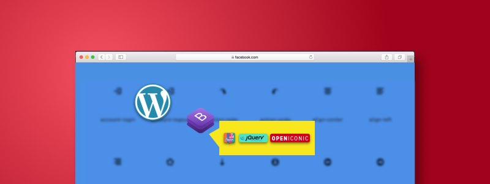

# Static Asset Development untuk WordPress Themes menggunakan Laravel Mix

Repo ini merupakan kerangka setup Development Environment WordPress baik themes maupun plugin (yang memiliki asset statis) yang dapat membantu kita melakukan hal-hal sebagai berikut dengan lebih cepat;

* Static Asset management baik Images, Javascript files dan modules, serta kompilasi Styles yang dikembangkan menggunakan SASS atau CSS preprocessor lainnya
* Membantu proses konfigurasi dalam melakukan kompilasi assets tersebut ke dalam satu file javascript dan satu file css, dengan catatan dukungan Webpack sudah ada
* Memudahkan proses penambahan terhadap kebutuhan eksternal, misalkan untuk menggunakan fonticon di Twitter Bootstrap v.4 yang sudah tidak lagi menyertakan glyphicon ke dalam rilisnya



## Static Assets untuk WordPress Themes Development

Contoh kasus kebutuhan terhadap eksternal script dan styles yang secara langsung didukung oleh repository ini adalah;

* Twitter Bootstrap 4.0.0-beta2 dengan custom theming melalui SASS
* jQuery dan Popper.js yang merupakan peer-dependency untuk Twitter Bootstrap 4 beta
* Menggunakan Open Iconic font untuk dukungan terhadap Glyphicon

Proses kompilasi asset tersebut ditambah dengan static assets lainnya seperti gambar dilakukan melalui **Laravel Mix** yang merupakan *wrapper* untuk **Webpack** dengan API yang sudah cukup memadai.

## Laravel Mix

Laravel Mix merupakan *front-end* tooling yang merupakan bagian dari core setup Laravel sejak versi 5.5-LTS.

Lebih lanjut mengenai Laravel Mix dapat dipelajari melalui Link dokumentasai di situs Laravel. https://laravel.com/docs/5.5/mix, di Link tersebut juga dapat dipelajari mengenai API yang disediakan oleh Laravel Mix sebagai interface ke Webpack.

## Direktori dan Lokasi file Assets Development

Agar lebih versatile dan bisa langsung digunakan dengan menggunakan setup yang sama ketika melakukan *Front End Development* di Laravel maka penempatan file untuk pengembangan dan output mirip dengan struktur di lingkungan pengembangan Laravel.

**Struktur Direktori dan Lokasi File**

``` bash
.
+-- node_modules (git ignored)
+-- resources (development directory)
|	+-- assets
|		+-- js
|		+-- img
|		+-- scss
|		+-- fonts
|		+-- icons
+-- dist (output directory)
|	+-- img
|	+-- js
|	+-- fonts
|	+-- icons
|	+-- style.css
+-- webpack.mix.js
+-- package.json
```

**Direktori pengembangan**

Direktori pengembangan dalam hal ini untuk melakukan theming terhadap Twitter Bootstrap dilakukan melalui direktori `resources/assets/scss`. Sementara untuk menambahkan function javascript kita sendiri dapat dilakukan melalui direktori `resources/assets/js`.

Direktori icons, fonts dan img didalam contoh ini baru sekedar merupakan tempat untuk meletakkan file yang akan kemudian dikopi ke direktori output. Untuk pengembangan lebih jauh kita dapat juga memanfaatkan Laravel Mix untuk melakukan pengolahan lanjutan seperti misalnya melakukan kompresi ulang terhadap keseluruhan file gambar yang digunakan. Atau memanfaatkan direktori icons untuk mempersiapkan setup icon dalam berbagai resolusi dan ukuran.

**Direktori Output**

Output direktori yang terdapat di dalam `dist` nantinya dapat digabungkan ke dalam direktori WordPress Themes `wp-content/themes/` dengan mempertahankan hal-hal sebagai berikut.

* Styles yang akan digunakan adalah `styles.css` yang terletak di *root directory* dist
* Direktori lainnya yaitu img, icons, fonts dan js sudah cukup jelas dan dapat dimodifikasi sesuai dengan setup anda melalui konfigurasi Laravel Mix di `webpack.mix.js`

**File Konfigurasi**

* File konfigurasi untuk menjalankan `webpack --watch` dan melakukan kompilasi dengan `webpack` adalah `package.json` yang juga berisikan informasi mengenai paket dan modul yang perlu diinstall
* Konfigurasi `webpack` dilakukan di dalam `webpack.min.js`, Laravel Mix akan mengambil konfigurasi bawaan dari dalam file modul `larevel-mix` yang terletak di dalam `node_modules`, konfigurasi bawaan tersebut sudah cukup memadai, namun dapat kita **extend** melalui API yang disediakan.

## Instalasi Repo dan Kompilasi Assets

* Clone repo dengan menggunakan `git clone https://url/repo/ini`
* Instalasi paket yang dibutuhkan `npm install`
* Melakukan kompilasi melalui `npm run dev`
* Kompilasi dalam proses pengembangan dapat menggunakan `npm run watch --pool`

``` bash
$ git clone https://github.com/tajidyakub/wp-assets-laravel-mix.git wp-assets
$ cd wp-assets
$ npm install
$ npm run dev
$ npm run watch --poll
```
Informasi mengenai Laravel Mix dan interface ke Webpack dpat dipelajari di file `webpack.mix.js`

